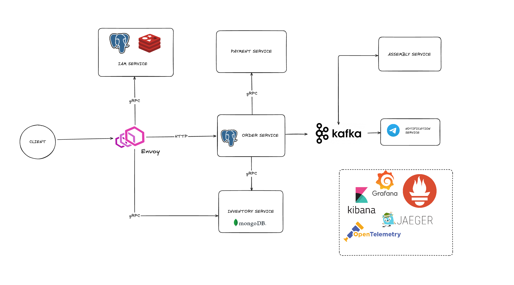

# rocket-science

- Разработаешь 6 микросервисов, связанных между собой через Kafka и gRPC, с изоляцией от внешнего мира с помощью Envoy Gateway
- Обеспечишь мониторинг сервиса по стандарту OpenTelemetry с интеграционными и e2e-тестами, чтобы исключить ошибки в работе
- Освоишь кеширование данных с помощью Redis и асинхронное взаимодействие между микросервисами с помощью Kafka
- Освоишь работу с PostgreSQL, написав свои компоненты-заготовки, упрощающие разработку
- Реализуешь межсервисное взаимодействие, систему аутентификации и авторизации
- На практике научишься применять архитектурные подходы построения микросервисов

# Домашняя работа

1
- Реализовать HTTP API для Order Service согласно контракту
- Реализовать gRPC API для Inventory Service и Payment Service
- Интегрировать gRPC-клиентов в Order Service, реализовав вызовы Inventory и Payment по заданной логике

2
- Привести архитектуру Order, Inventory, Payment сервисов к виду, разобранному в уроках
- Настроить вывод покрытия тестов в README.md каждого сервиса
- Обеспечить покрытие юнит-тестами минимум 40% кода в каждом из трёх сервисов

3
- Написать docker-compose для Order Service и Inventory Service, включая PostgreSQL и MongoDB
- В Order Service заменить map на PostgreSQL с полноценной миграцией таблицы заказов
- В Inventory Service перейти с map на MongoDB
- Обновить unit-тесты, если логика работы с данными изменилась

4
- Реализовать конфигурацию через переменные окружения во всех трёх сервисах
- Внедрить DI-контейнер в Order, Inventory, Payment сервисы
- Написать как минимум один интеграционный тест для репозитория в Order Service
- Написать как минимум один e2e тест для gRPC API Inventory Service
- Реализовать платформенную библиотеку с обёрткой над логгером и интегрировать её в сервисы

5
- Поднять Kafka в KRaft-режиме с одним брокером через Docker Compose
- Создать сервис Assembly Service в том же архитектурном стиле (конфигурация, DI, слои)

В Assembly Service:
- Реализовать Kafka Consumer события оплаты заказа
- Добавить задержку 10 секунд
- Отправить событие об успешной сборке

В Order Service:
- Реализовать Kafka Producer, отправляющий событие оплаты
- Реализовать Kafka Consumer события сборки и обновить статус заказа

- Создать сервис Notification Service в том же архитектурном стиле (конфигурация, DI, слои)
- В Notification Service реализовать Kafka Consumer, слушающий событие оплаты и событие сборки, и отправляющий уведомление в Telegram

6
- Создать сервис IAM Service в том же архитектурном стиле (конфигурация, DI, слои)
- Реализовать gRPC API для IAM Service согласно контракту auth_service_contracts.md
- В Inventory Service реализовать интерцептор, проверяющий валидность сессии
- Хранить данные о пользователях в PostgreSQL, обеспечить миграции при старте сервиса
- Хранить данные о сессиях в Redis с TTL 24 часа, используя ключи и хэш-структуры
- В Notification Service добавить запрос к IAM Service на получение информации о способе связи пользователя (например, Telegram ID) перед отправкой уведомления

7
- Настроить сохранение логов всех сервисов в хранилище и их отображение в Kibana

Настроить сбор метрик:
- В Order Service — количество заказов и суммарную выручку
- В Assembly Service — время сборки ракеты

- Настроить алерт: если за минуту оформляется более 10 заказов, отправлять уведомление в Telegram
- Добавить трассировку запроса в Order Service: от входа до вызовов в Payment Service и Inventory Service
- Вынести логику создания спанов и другие общие инструменты наблюдаемости в платформенную библиотеку

8
- Настроить Envoy как единую точку входа в систему
- Прописать маршруты к сервисам: HTTP и gRPC
- Добавить проверку сессии через IAM-сервис на каждый входящий запрос (Lua-скрипт)
- Скрыть все сервисы за Envoy — оставить наружу только один порт
- Завернуть все сервисы в Docker-контейнеры и подключить их к общей системе через Docker Compose

# Project Architecture

